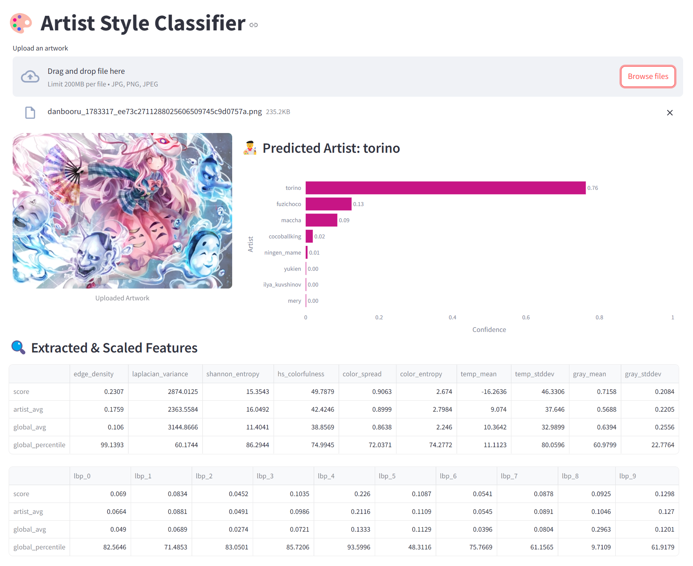

# Artist Classification Neural Network

## Objective

Develop a Convulutional Neural Network (CNN) that is able to differentiate between artist styles.

## Requirements

Python 3.11.x with the dependencies in `requirements.txt` installed.

## Dataset

We choose a dataset from 8 artists that we like ('mery', 'torino', 'yukien', 'ningen_mame', 'cocoballking', 'fuzichoco', 'maccha', 'ilya_kuvshinov') that have a large sample of artwork. They have been scraped from image hosting sites and preprocessed such that all images are at most 400 pixels wide. (see: `scrape.ipynb`)

We perform feature extraction on the scraped data in `feature_extraction.ipynb`: edge_density, laplacian_variance, shannon_entropy, hs_colorfulness, color_spread, color_entropy, temp_mean, temp_stddev, gray_mean, gray_stddev, lbp_0, lbp_1, lbp_2, lbp_3, lbp_4, lbp_5, lbp_6, lbp_7, lbp_8, lbp_9. These are then compiled into `dataset.csv` from which we train our models.

These features not only may aid the accuracy of the CNN, but allow us to better understand the qualities of each artist. (see: `data_visualization.ipynb`)

## Models 

- `model_naive.ipynb`: Implements a neural network with only linear layers, with the image is input.
- `model_metrics_only`:  Implements a neural network with only linear layers, with the extracted features as input.
- `model_cnn_basic.ipynb`: Implements a basic CNN.
- `model_cnn_hyperparam_tuning.ipynb`: Performs hyperparameter tuning on the CNN.
- `model_cnn_dataaugment.ipynb`: Implements a CNN with data augmentation.
- `model_cnn_resnet.ipynb`: Implements a CNN that finetunes the Resnet 50 pretrained model.
- `model_cnn_vgg16.ipynb`: Implements a CNN that finetunes the VGG16 pretrained model.
- `model_cnn_vgg16_hybrid.ipynb` (the final model): Implements a hybrid CNN that finetunes the VGG16 pretrained model with the addional features extracted from `feature_extraction.ipynb`.

The final model is saved as `model.h5` together with a feature scaler `scaler.pkl`.

## User Interface

To complement model evaluation, a user interface (UI) was developed using Streamlit to provide an interactive experience. The UI enables users to upload an artwork and receive predictions on the most likely artist behind the style, along with visual explanations and feature breakdowns.

Upon uploading an image, it is resized and normalized before being passed to the CNN model. Simultaneously, handcrafted features are extracted from the image using a custom feature extraction module and scaled using the pre-fitted scaler.

The UI also presents extracted and scaled features, compared against both global and artist-specific averages, along with percentile ranks derived from the dataset.